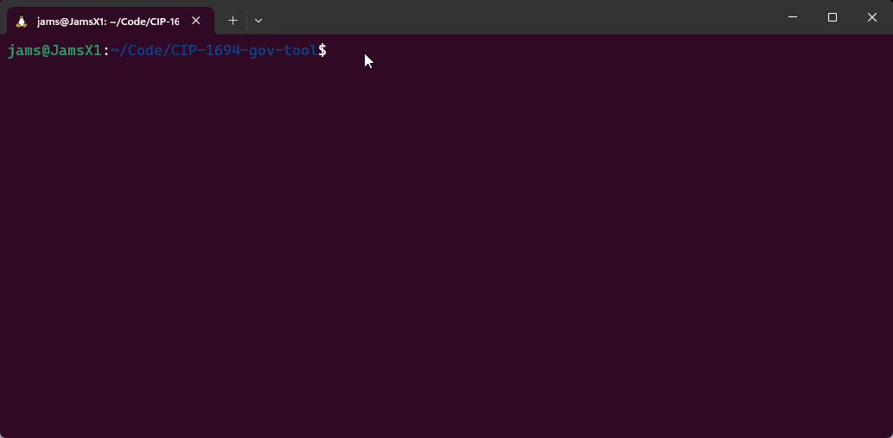

# CC scripts E2E example
In this E2E example, we will demonstrate how the CC scripts can be deployed and how to operate them. For convenience, this example uses a local testnet that, when spun up, has a hard-coded CC script credential fixed in its genesis configuration file. Due to this setup method where we hard-code the member at startup, the currency symbols used to parameterize both the cold and hot credential of the CC member are derived from the always true minting script (called `coldAlwaysTrueMint` and `hotAlwaysTrueMint`).

This E2E example also uses a simple dummy X509 certificate tree that can be found in the `/X509-cert-example/CA` folder. As an overview, this CA has nine children of which the first three will hold the Membership role, the next three will hold the Delegation role and the last three will hold the Voter role as per the following the overview.


## Prerequisites

You need to have Nix shell installed to follow this example. Note that you will use two terminal windows: one for deploying a Cardano local testnet and another to compile and run the scripts.

## Compiling the scripts

The CC scripts are comprised of four Plutus scripts (besides the minting scripts), two spending scripts and two certification scripts that only take in a redeemer.

To compile these Plutus scripts and save them to disk, open a terminal window and run the following command:

```bash
nix run .#plutus-gov-tool:exe:write-scripts
```

This will compile and write the `coldAlwaysTrueMint` and `hotAlwaysTrueMint` scripts to disk and apply the former currency symbol to the cold credential CC credential to constrain it to the `Identity NFT`, after which this script is also written to disk. Then, the same currency symbols are used for the `Vote NFT` and applied to the hot credential and the hot locking script. Besides the scripts, this will also write some basic datums and redeemers for the purpose of the example in the `assets` folder.

Now that we have the scripts, we can determine the script hash of the Cold credential to hard-code it into the genesis configuration located in `/local-testnet/scripts/babbage/conway-babbage-test-genesis.json`.

Start an interactive Nix shell as follows to enable the `cardano-cli` command:

```bash
nix develop
```

> **Note:** The first time you run this command it can take some time depending on your system.

Next, we can obtain the script hash of the Cold credential to hard-code it into the genesis configuration as follows:

```bash
cardano-cli transaction policyid --script-file assets/V3/coldCredentialScript.plutus
```

## Deploy local testnet

To deploy the local testnet, open a second terminal window and enter the developer shell via `nix develop`. This will bring one of the latest versions of `cardano-node`and `cardano-cli` into your path. You can check this version against:

```bash
cardano-node --version
```

Next, we can see a text output that shows our Cardano node version.

```text
cardano-node 8.9.0 - linux-x86_64 - ghc-8.10
git rev 11d12d8fb6a4d65a996884f283bb40d66d904bbf
```

Besides the node and cli, Nix shell also provides a few bash scripts to your path that will be used to showcase the CC scripts. To deploy the local testnet, run the following script:

```bash
deploy-local-testnet
```

The animation below shows an example of successfully deploying a testnet.



The `deploy-local-testnet` script will run the `scripts/babbage/mkfiles.sh` and run the Cardano nodes. Keep this script running in the shell.

You can verify that your testnet is deployed by running the following command in your first terminal window:

```bash
cardano-cli conway query committee-state --testnet-magic 42
```
This command shows our hard-coded cold committee member as follows.

```json
{
    "committee": {
        "scriptHash-df70d478148ea26f5bdb758a3e5d54b066b6c4668734735d1ed33d40": {
            "expiration": 50000,
            "hotCredsAuthStatus": {
                "tag": "MemberNotAuthorized"
            },
            "nextEpochChange": {
                "tag": "NoChangeExpected"
            },
            "status": "Active"
        }
    },
    "epoch": 16,
    "quorum": 0.0
}
```

> **Note:** In case you need to specify the node socket path, this is located in `/local-testnet/example/node-spo1/node.sock`.

You can use `Ctrl + C` to forcefully terminate the scripts that run the nodes. If you want to respin the network again, you can use the `purge-local-testnet` command, this will delete the blockchain (after which you can deploy again).

## Bootstrap scripts
As mentioned above, in setting up this local testnet, we hard-coded the cold CC credential. But this is just a part of the solution, as per the scripts, this credential is governed by the `Identity NFT`, so we have to mint this first and lock it in our cold credential locking script (script Spend-1 in the diagram) (similarly for the `Vote NFT` and the Spend-2 script). 

To fund these transactions, we use the keys in the `/local-testnet/example/utxo-keys` folder. For convenience, we create a new directory for this in the x509 example folder and copy one of the key pairs.
```bash
mkdir x509-cert-example/orchestrator
cd x509-cert-example/orchestrator
cp ../../local-testnet/example/utxo-keys/utxo1.skey ./orchestrator.skey
cp ../../local-testnet/example/utxo-keys/utxo1.vkey ./orchestrator.vkey
cardano-cli address build --testnet-magic 42 --payment-verification-key-file orchestrator.vkey > orchestrator.addr
```
If all went well, you should be able to see the funds via
```bash
cardano-cli query utxo --testnet-magic 42 --address $(cat orchestrator.addr)
```
If you see `cardano-cli: Network.Socket.connect: <socket: 11>: does not exist (No such file or directory)` wait for the testnet to be fully deployed, or check that the path to the node socket it correct.

To mint the two NFT's (the `Identity NFT` and `Vote NFT`) we first calculate the minting policy of the `alwaysTrueMint.plutus` script via
```bash
cardano-cli transaction policyid --script-file ../../assets/V3/coldAlwaysTrueMint.plutus > coldAlwaysTrueMint.pol
cardano-cli transaction policyid --script-file ../../assets/V3/hotAlwaysTrueMint.plutus > hotAlwaysTrueMint.pol
```
Then we get the address of the two lock scripts via
```bash
cardano-cli address build --testnet-magic 42 --payment-script-file ../../assets/V3/coldLockScript.plutus > coldLockScript.addr
cardano-cli address build --testnet-magic 42 --payment-script-file ../../assets/V3/hotLockScript.plutus > hotLockScript.addr
```
When the scripts were written to disk, it also wrote the initial datums for the cold and hot locking scripts, where the first three children hold the Membership role and the next three children the Delegate role, the last three children hold the Voter role. These datums are stored in the `/assets/datums` folder. We now have everything to deploy our application with the initial state. Please note that both locking scripts require the datum to be inline, having just a hash makes it unspendable. We can create such a transaction via
```bash
cardano-cli conway transaction build --testnet-magic 42 \
 --tx-in "$(cardano-cli query utxo --address "$(cat orchestrator.addr)" --testnet-magic 42 --out-file /dev/stdout | jq -r 'keys[0]')" \
 --tx-in-collateral "$(cardano-cli query utxo --address "$(cat orchestrator.addr)" --testnet-magic 42 --out-file /dev/stdout | jq -r 'keys[0]')" \
 --mint "1 $(cat coldAlwaysTrueMint.pol).4964656e74697479204e4654 + 1 $(cat hotAlwaysTrueMint.pol).566f7465204e4654" \
 --tx-out $(cat coldLockScript.addr)+5000000+"1 $(cat coldAlwaysTrueMint.pol).4964656e74697479204e4654" \
 --tx-out-inline-datum-file ../../assets/datums/initColdLockScriptDatum.json \
 --tx-out $(cat hotLockScript.addr)+5000000+"1 $(cat hotAlwaysTrueMint.pol).566f7465204e4654" \
 --tx-out-inline-datum-file ../../assets/datums/initHotLockScriptDatum.json \
 --change-address $(cat orchestrator.addr) \
 --mint-script-file ../../assets/V3/coldAlwaysTrueMint.plutus --mint-redeemer-value {} \
 --mint-script-file ../../assets/V3/hotAlwaysTrueMint.plutus --mint-redeemer-value {} \
 --out-file tx.raw
```
which the orchestrator can sign and submit via
```bash
cardano-cli transaction sign --testnet-magic 42 --signing-key-file orchestrator.skey --tx-body-file tx.raw --out-file tx.signed
cardano-cli transaction submit --testnet-magic 42 --tx-file tx.signed
```
If we query the blockchain again, we can view the result via
```bash
cardano-cli query utxo --testnet-magic 42 --address $(cat coldLockScript.addr)
cardano-cli query utxo --testnet-magic 42 --address $(cat hotLockScript.addr)
```
You can also add the `--output-json` flag to make the inline datum more readable.
## Delegate voting right to hot credential
Now that we have hard-coded the cold credential in the list of CC members and locked the assets, we can utilize the cold locking script to delegate their voting right to our hot credential script. This because the CC member did not authorize one yet, which we can see using
```bash
cardano-cli conway query committee-state --testnet-magic 42
```
This command shows our hard-coded cold committee member, but it hash not authorized hot credential,
```bash
{
    "committee": {
        "scriptHash-XXXXXX": {
            "expiration": 50000,
            "hotCredsAuthStatus": {
                "tag": "MemberNotAuthorized"
            },
            "nextEpochChange": {
                "tag": "NoChangeExpected"
            },
            "status": "Active"
        }
    },
    "epoch": 7,
    "quorum": 0.0
}
```
To create an authorization certificate from the cold credential script to the hot credential script, you can use
```bash
cardano-cli conway governance committee create-hot-key-authorization-certificate --cold-script-file ../../assets/V3/coldCredentialScript.plutus --hot-script-file ../../assets/V3/hotCredentialScript.plutus --out-file cc-hot-auth.cert
```
To issue certificate via the cold locking script, we can use 
```bash
cardano-cli conway transaction build --testnet-magic 42 \
 --tx-in "$(cardano-cli query utxo --address "$(cat orchestrator.addr)" --testnet-magic 42 --out-file /dev/stdout | jq -r 'keys[0]')" \
 --tx-in-collateral "$(cardano-cli query utxo --address "$(cat orchestrator.addr)" --testnet-magic 42 --out-file /dev/stdout | jq -r 'keys[0]')" \
 --tx-in "$(cardano-cli query utxo --address "$(cat coldLockScript.addr)" --testnet-magic 42 --out-file /dev/stdout | jq -r 'keys[0]')" \
 --tx-in-script-file ../../assets/V3/coldLockScript.plutus \
 --tx-in-inline-datum-present \
 --tx-in-redeemer-file ../../assets/redeemers/delegateRedeemer.json \
 --tx-out $(cat coldLockScript.addr)+5000000+"1 $(cat coldAlwaysTrueMint.pol).4964656e74697479204e4654" \
 --tx-out-inline-datum-file ../../assets/datums/initColdLockScriptDatum.json \
 --required-signer-hash $(cat ../CA/children/child-4/child-4.keyhash) \
 --required-signer-hash $(cat ../CA/children/child-5/child-5.keyhash) \
 --certificate-file cc-hot-auth.cert \
 --certificate-script-file ../../assets/V3/coldCredentialScript.plutus \
 --certificate-redeemer-value {} \
 --change-address $(cat orchestrator.addr) \
 --out-file tx.raw
```
Which can be signed and sent quickly via
```bash
cardano-cli transaction sign --testnet-magic 42 \
 --signing-key-file orchestrator.skey \
 --signing-key-file ../CA/children/child-4/child-4.skey \
 --signing-key-file ../CA/children/child-5/child-5.skey \
 --tx-body-file tx.raw \
 --out-file tx.signed
cardano-cli transaction submit --testnet-magic 42 --tx-file tx.signed
```
Alternatively, this transaction can be partly signed separately by each party via the command `cardano-cli transaction witness` command
```bash
cardano-cli transaction witness \
  --tx-body-file tx.raw \
  --signing-key-file ../CA/children/child-4/child-4.skey \
  --testnet-magic 42 \
  --out-file txPartialChild4.witness
```
and for child 5
```bash
cardano-cli transaction witness \
  --tx-body-file tx.raw \
  --signing-key-file ../CA/children/child-5/child-5.skey \
  --testnet-magic 42 \
  --out-file txPartialChild5.witness
```
lastly for the orchestrator
```bash
cardano-cli transaction witness \
  --tx-body-file tx.raw \
  --signing-key-file orchestrator.skey \
  --testnet-magic 42 \
  --out-file txPartialOrchestrator.witness
```
and aggregated via
```bash
cardano-cli transaction assemble \
  --tx-body-file tx.raw \
  --witness-file txPartialOrchestrator.witness \
  --witness-file txPartialChild4.witness \
  --witness-file txPartialChild5.witness \
  --out-file tx.signed
cardano-cli transaction submit --testnet-magic 42 --tx-file tx.signed
```
If we now query the committee state again, we see that the hot credential is authorized and given by the `hotCredentialScript.plutus` (Cert-2 in the diagram) script hash
```bash
cardano-cli conway query committee-state --testnet-magic 42
cardano-cli transaction policyid --script-file ../../assets/V3/hotCredentialScript.plutus
```
Which now will show a script credential for the hot credential,
```bash
{
    "committee": {
        "scriptHash-XXXXXXXX": {
            "expiration": 50000,
            "hotCredsAuthStatus": {
                "contents": {
                    "scriptHash": "YYYYYYYY"
                },
                "tag": "MemberAuthorized"
            },
            "nextEpochChange": {
                "tag": "NoChangeExpected"
            },
            "status": "Active"
        }
    },
    "epoch": 9,
    "quorum": 0.0
}
```
The scripts are now both deployed and configured as intended.

## Vote on a Governance Action
Now that the Dapp is deployed, we can use in its current configuration where we have three people in the voter role, of which at least two need to witness the vote. 

But before we can vote, we have to create an action, if you use 
```bash
cardano-cli conway query gov-state --testnet-magic 42 | jq -r '.proposals'
```
you will see that none exist. To make it easy in this example, you can use the `createDummyAction` command, which will create an action to set the `"keyDeposit"` parameter from 2 ada to 1 ada (this is for registering a staking key). With the same command as above, we can view the current status of this proposal. Which looks something like this
```bash
[
  {
    "action": {
      "contents": [
        null,
        {
          "keyDeposit": 1000000
        },
        null
      ],
      "tag": "ParameterChange"
    },
    "actionId": {
      "govActionIx": 0,
      "txId": "043cce46a8bb751c169b2692ff9cf7b3923c03960521383a39a6cd817b917f6e"
    },
    "committeeVotes": {},
    "dRepVotes": {},
    "deposit": 1000000000,
    "expiresAfter": 33,
    "proposedIn": 23,
    "returnAddr": {
      "credential": {
        "keyHash": "df6c80810b8a030ea7a5e9fe73a5a6d5638dbb0c7304bc90a4d95e56"
      },
      "network": "Testnet"
    },
    "stakePoolVotes": {}
  }
]
```
Notice that the `"committeCotes"` is empty. Let's vote on this proposal, you can create a `yes/no` vote via
```bash
cardano-cli conway governance vote create \
    --yes \
    --governance-action-tx-id "$(cardano-cli conway query gov-state --testnet-magic 42 | jq -r '.proposals[0].actionId.txId')" \
    --governance-action-index "0" \
    --cc-hot-script-hash  $(cardano-cli transaction policyid --script-file ../../assets/V3/hotCredentialScript.plutus)\
    --out-file paramChange.vote
```
Then to vote via our CC Vote credential, we have to witness the `Vote NFT` and thus create a transaction that witnesses it. We can do this via
```bash
cardano-cli query protocol-parameters --testnet-magic 42 --out-file pparams.json
cardano-cli conway transaction build-raw \
 --tx-in "$(cardano-cli query utxo --address "$(cat orchestrator.addr)" --testnet-magic 42 --out-file /dev/stdout | jq -r 'keys[0]')" \
 --tx-in-collateral "$(cardano-cli query utxo --address "$(cat orchestrator.addr)" --testnet-magic 42 --out-file /dev/stdout | jq -r 'keys[0]')" \
 --tx-in "$(cardano-cli query utxo --address "$(cat hotLockScript.addr)" --testnet-magic 42 --out-file /dev/stdout | jq -r 'keys[0]')" \
 --tx-in-script-file ../../assets/V3/hotLockScript.plutus \
 --tx-in-inline-datum-present \
 --tx-in-redeemer-file ../../assets/redeemers/voteRedeemer.json \
 --tx-in-execution-units "(3000000000, 4000000)" \
 --tx-out $(cat hotLockScript.addr)+5000000+"1 $(cat hotAlwaysTrueMint.pol).566f7465204e4654" \
 --tx-out-inline-datum-file ../../assets/datums/initHotLockScriptDatum.json \
 --required-signer-hash $(cat ../CA/children/child-7/child-7.keyhash) \
 --required-signer-hash $(cat ../CA/children/child-8/child-8.keyhash) \
 --vote-file paramChange.vote \
 --vote-script-file ../../assets/V3/hotCredentialScript.plutus \
 --vote-redeemer-value {} \
 --vote-execution-units "(6000000000,4000000)" \
 --tx-out $(cat orchestrator.addr)+599983812195 \
 --fee 4999310 \
 --protocol-params-file pparams.json \
 --out-file tx.raw
```
which can be signed via
```bash
cardano-cli transaction sign --testnet-magic 42 \
 --signing-key-file orchestrator.skey \
 --signing-key-file ../CA/children/child-7/child-7.skey \
 --signing-key-file ../CA/children/child-8/child-8.skey \
 --tx-body-file tx.raw \
 --out-file tx.signed
cardano-cli transaction submit --testnet-magic 42 --tx-file tx.signed
```
If we now do
```bash
cardano-cli conway query gov-state --testnet-magic 42 | jq -r '.proposals'
```
We see that the hot credential, we authorized above, voted yes on the proposal.
## Resign as delegation role
A key that is assigned the delegation role, can unilateral resign their position in the list by creating a resign transaction. In the following example we will resign child 4, to verify that this public key is still in the list of the delegation role we can use
```bash
cardano-cli query utxo --testnet-magic 42 --address $(cat coldLockScript.addr) --output-json | jq 'to_entries[] | select(.value.inlineDatum != null) | .value.inlineDatum.fields[] | .. | .bytes? | select(. == "fc6a114db76d31de585793749dcd6ad2d6c02a52ce9226820656bedd")'
```
The resign transaction for this child is given by this,
```bash 
cardano-cli conway transaction build --testnet-magic 42 \
 --tx-in "$(cardano-cli query utxo --address "$(cat orchestrator.addr)" --testnet-magic 42 --out-file /dev/stdout | jq -r 'keys[0]')" \
 --tx-in-collateral "$(cardano-cli query utxo --address "$(cat orchestrator.addr)" --testnet-magic 42 --out-file /dev/stdout | jq -r 'keys[0]')" \
 --tx-in "$(cardano-cli query utxo --address "$(cat coldLockScript.addr)" --testnet-magic 42 --out-file /dev/stdout | jq -r 'keys[0]')" \
 --tx-in-script-file ../../assets/V3/coldLockScript.plutus \
 --tx-in-inline-datum-present \
 --tx-in-redeemer-file ../../assets/redeemers/resignMemberChild4Redeemer.json \
 --tx-out $(cat coldLockScript.addr)+5000000+"1 $(cat coldAlwaysTrueMint.pol).4964656e74697479204e4654" \
 --tx-out-inline-datum-file ../../assets/datums/resignMemberChild4NewDatum.json \
 --required-signer-hash $(cat ../CA/children/child-4/child-4.keyhash) \
 --change-address $(cat orchestrator.addr) \
 --out-file tx.raw
```
which can be partialy witnessed by the orchestrator and child-4 via
```bash
cardano-cli transaction witness \
  --tx-body-file tx.raw \
  --signing-key-file orchestrator.skey \
  --testnet-magic 42 \
  --out-file txPartialOrchestrator.witness
```
and
```bash
cardano-cli transaction witness \
  --tx-body-file tx.raw \
  --signing-key-file ../CA/children/child-4/child-4.skey \
  --testnet-magic 42 \
  --out-file txPartialChild4.witness
```
And assembled via
```bash
cardano-cli transaction assemble \
  --tx-body-file tx.raw \
  --witness-file txPartialOrchestrator.witness \
  --witness-file txPartialChild4.witness \
  --out-file tx.signed
cardano-cli transaction submit --testnet-magic 42 --tx-file tx.signed
```
If we now take a look at the datum of the UTxO where the `Identity NFT` resides,
```bash
cardano-cli query utxo --testnet-magic 42 --address $(cat coldLockScript.addr) --output-json | jq 'to_entries[] | select(.value.inlineDatum != null) | .value.inlineDatum.fields[] | .. | .bytes? | select(. == "fc6a114db76d31de585793749dcd6ad2d6c02a52ce9226820656bedd")'
```
we see that the `jq` filter cannot find the key of child 4 in the datum, it has been removed.

> **Note:** The above transaction is not completly "unilateral", as the orchesrator needed to sign the transaction. In this example this is just a practicality, the child that resigned, could have funded the transaction on its own.

## Insert or remove as membership role
As the owner of the `Identity NFT`, the group in the membership role have full control over the UTxO that holds it. This means that they can do anything with it, which includes the removal and/or insertion of entries in the delegation role list. To demonstrate this, we will insert child 4 back in the list of delegetees (since we just removed that above). This can be done via the following transaction
```bash
cardano-cli conway transaction build --testnet-magic 42 \
 --tx-in "$(cardano-cli query utxo --address "$(cat orchestrator.addr)" --testnet-magic 42 --out-file /dev/stdout | jq -r 'keys[0]')" \
 --tx-in-collateral "$(cardano-cli query utxo --address "$(cat orchestrator.addr)" --testnet-magic 42 --out-file /dev/stdout | jq -r 'keys[0]')" \
 --tx-in "$(cardano-cli query utxo --address "$(cat coldLockScript.addr)" --testnet-magic 42 --out-file /dev/stdout | jq -r 'keys[0]')" \
 --tx-in-script-file ../../assets/V3/coldLockScript.plutus \
 --tx-in-inline-datum-present \
 --tx-in-redeemer-file ../../assets/redeemers/recoverColdRedeemer.json \
 --tx-out $(cat coldLockScript.addr)+5000000+"1 $(cat coldAlwaysTrueMint.pol).4964656e74697479204e4654" \
 --tx-out-inline-datum-file ../../assets/datums/initColdLockScriptDatum.json \
 --required-signer-hash $(cat ../CA/children/child-1/child-1.keyhash) \
 --required-signer-hash $(cat ../CA/children/child-2/child-2.keyhash) \
 --change-address $(cat orchestrator.addr) \
 --out-file tx.raw
```
which can be partialy witnessed by the orchestrator, child 1 and 2 via
```bash
cardano-cli transaction witness \
  --tx-body-file tx.raw \
  --signing-key-file orchestrator.skey \
  --testnet-magic 42 \
  --out-file txPartialOrchestrator.witness
```
and
```bash
cardano-cli transaction witness \
  --tx-body-file tx.raw \
  --signing-key-file ../CA/children/child-1/child-1.skey \
  --testnet-magic 42 \
  --out-file txPartialChild1.witness
```
And assembled via
```bash
cardano-cli transaction assemble \
  --tx-body-file tx.raw \
  --witness-file txPartialOrchestrator.witness \
  --witness-file txPartialChild1.witness \
  --witness-file txPartialChild2.witness \
  --out-file tx.signed
cardano-cli transaction submit --testnet-magic 42 --tx-file tx.signed
```
If we now take a look at the datum of the UTxO where the `Identity NFT` resides,
```bash
cardano-cli query utxo --testnet-magic 42 --address $(cat coldLockScript.addr) --output-json | jq 'to_entries[] | select(.value.inlineDatum != null) | .value.inlineDatum.fields[] | .. | .bytes? | select(. == "fc6a114db76d31de585793749dcd6ad2d6c02a52ce9226820656bedd")'
```
we see that the `jq` filter can find the key of child 4 in the datum again, it has been added succesfully.

## Resign as vote role
Similar to the delegetee role, the voter role can also unilateral resign their position in the list. In the following example we will resign child 7, to verify that this public key is still in the list of the delegation role we can use
```bash
cardano-cli query utxo --testnet-magic 42 --address $(cat hotLockScript.addr) --output-json | jq 'to_entries[] | select(.value.inlineDatum.list != null) | .value.inlineDatum.list[].fields[] | .bytes? | select(. == "fb5e0be4801aea73135efe43f4a3a6d08147af523112986dd5e7d13b")'
```
The resign transaction for this child is given by this,
```bash
cardano-cli conway transaction build --testnet-magic 42 \
 --tx-in "$(cardano-cli query utxo --address "$(cat orchestrator.addr)" --testnet-magic 42 --out-file /dev/stdout | jq -r 'keys[0]')" \
 --tx-in-collateral "$(cardano-cli query utxo --address "$(cat orchestrator.addr)" --testnet-magic 42 --out-file /dev/stdout | jq -r 'keys[0]')" \
 --tx-in "$(cardano-cli query utxo --address "$(cat hotLockScript.addr)" --testnet-magic 42 --out-file /dev/stdout | jq -r 'keys[0]')" \
 --tx-in-script-file ../../assets/V3/hotLockScript.plutus \
 --tx-in-inline-datum-present \
 --tx-in-redeemer-file ../../assets/redeemers/resignMemberChild7Redeemer.json \
 --tx-out $(cat hotLockScript.addr)+5000000+"1 $(cat hotAlwaysTrueMint.pol).566f7465204e4654" \
 --tx-out-inline-datum-file ../../assets/datums/resignMemberChild7NewDatum.json \
 --required-signer-hash $(cat ../CA/children/child-7/child-7.keyhash) \
 --change-address $(cat orchestrator.addr) \
 --out-file tx.raw
```
which can be signed via
```bash
cardano-cli transaction witness \
  --tx-body-file tx.raw \
  --signing-key-file orchestrator.skey \
  --testnet-magic 42 \
  --out-file txPartialOrchestrator.witness
```
and
```bash
cardano-cli transaction witness \
  --tx-body-file tx.raw \
  --signing-key-file ../CA/children/child-7/child-7.skey \
  --testnet-magic 42 \
  --out-file txPartialChild7.witness
```
Combining it and sending it to the chain can be done via
```bash
cardano-cli transaction assemble \
  --tx-body-file tx.raw \
  --witness-file txPartialOrchestrator.witness \
  --witness-file txPartialChild7.witness \
  --out-file tx.signed
cardano-cli transaction submit --testnet-magic 42 --tx-file tx.signed
```
Checking if the public key hash of child 7 is in the datum via
```bash
cardano-cli query utxo --testnet-magic 42 --address $(cat hotLockScript.addr) --output-json | jq 'to_entries[] | select(.value.inlineDatum.list != null) | .value.inlineDatum.list[].fields[] | .bytes? | select(. == "fb5e0be4801aea73135efe43f4a3a6d08147af523112986dd5e7d13b")'
```
shows that it has been removed from the list.

## Insert or remove as delegation role
As the owner of the `Vote NFT`, the group in the delegatee role have full control over the UTxO that holds it. This means that they can do anything with it, which includes the removal and/or insertion of entries in the vote role list. To demonstrate this, we will insert child 7 back in the list of votees (since we just removed that above). This can be done via the following transaction
```bash
cardano-cli conway transaction build --testnet-magic 42 \
 --tx-in "$(cardano-cli query utxo --address "$(cat orchestrator.addr)" --testnet-magic 42 --out-file /dev/stdout | jq -r 'keys[0]')" \
 --tx-in-collateral "$(cardano-cli query utxo --address "$(cat orchestrator.addr)" --testnet-magic 42 --out-file /dev/stdout | jq -r 'keys[0]')" \
 --tx-in "$(cardano-cli query utxo --address "$(cat hotLockScript.addr)" --testnet-magic 42 --out-file /dev/stdout | jq -r 'keys[0]')" \
 --tx-in-script-file ../../assets/V3/hotLockScript.plutus \
 --tx-in-inline-datum-present \
 --tx-in-redeemer-file ../../assets/redeemers/recoverHotRedeemer.json \
 --read-only-tx-in-reference "$(cardano-cli query utxo --address "$(cat coldLockScript.addr)" --testnet-magic 42 --out-file /dev/stdout | jq -r 'keys[0]')" \
 --tx-out $(cat hotLockScript.addr)+5000000+"1 $(cat hotAlwaysTrueMint.pol).566f7465204e4654" \
 --tx-out-inline-datum-file ../../assets/datums/initHotLockScriptDatum.json \
 --required-signer-hash $(cat ../CA/children/child-4/child-4.keyhash) \
 --required-signer-hash $(cat ../CA/children/child-5/child-5.keyhash) \
 --change-address $(cat orchestrator.addr) \
 --out-file tx.raw
```
and sign it via
```bash
cardano-cli transaction sign --testnet-magic 42 \
 --signing-key-file orchestrator.skey \
 --signing-key-file ../CA/children/child-4/child-4.skey \
 --signing-key-file ../CA/children/child-5/child-5.skey \
 --tx-body-file tx.raw \
 --out-file tx.signed
cardano-cli transaction submit --testnet-magic 42 --tx-file tx.signed
```
Once again we can check if this public key hash of child 7 is present in the datum via
```bash
cardano-cli query utxo --testnet-magic 42 --address $(cat hotLockScript.addr) --output-json | jq 'to_entries[] | select(.value.inlineDatum.list != null) | .value.inlineDatum.list[].fields[] | .bytes? | select(. == "fb5e0be4801aea73135efe43f4a3a6d08147af523112986dd5e7d13b")'
```
## Resign cold CC credential
Besides authorizing a hot credential, the cold credential can also witness a resign certificate, this deactivates the hardcoded CC credential. This action can not be reverted, so use it wisely. The only way a cold credential can reenter the list of CC credentials is via a governance action, on which the Dreps and SPO's must vote. To resign the cold script credential you can create a resign certificate via,
```bash
cardano-cli conway governance committee create-cold-key-resignation-certificate --cold-script-hash $(cardano-cli transaction policyid --script-file ../../assets/V3/coldCredentialScript.plutus) --out-file resignColdCredential.cert
```
To witness this certificate we use the following build command,
```bash
cardano-cli conway transaction build --testnet-magic 42 \
 --tx-in "$(cardano-cli query utxo --address "$(cat orchestrator.addr)" --testnet-magic 42 --out-file /dev/stdout | jq -r 'keys[0]')" \
 --tx-in-collateral "$(cardano-cli query utxo --address "$(cat orchestrator.addr)" --testnet-magic 42 --out-file /dev/stdout | jq -r 'keys[0]')" \
 --tx-in "$(cardano-cli query utxo --address "$(cat coldLockScript.addr)" --testnet-magic 42 --out-file /dev/stdout | jq -r 'keys[0]')" \
 --tx-in-script-file ../../assets/V3/coldLockScript.plutus \
 --tx-in-inline-datum-present \
 --tx-in-redeemer-file ../../assets/redeemers/recoverColdRedeemer.json \
 --tx-out $(cat coldLockScript.addr)+5000000+"1 $(cat coldAlwaysTrueMint.pol).4964656e74697479204e4654" \
 --tx-out-inline-datum-file ../../assets/datums/initColdLockScriptDatum.json \
 --required-signer-hash $(cat ../CA/children/child-1/child-1.keyhash) \
 --required-signer-hash $(cat ../CA/children/child-2/child-2.keyhash) \
 --certificate-file resignColdCredential.cert \
 --certificate-script-file ../../assets/V3/coldCredentialScript.plutus \
 --certificate-redeemer-value {} \
 --change-address $(cat orchestrator.addr) \
 --out-file tx.raw
```
This can be signed by the majority of the entries in the membership role via,
```bash
cardano-cli transaction witness \
  --tx-body-file tx.raw \
  --signing-key-file ../CA/children/child-1/child-1.skey \
  --testnet-magic 42 \
  --out-file txPartialChild1.witness
```
and
```bash
cardano-cli transaction witness \
  --tx-body-file tx.raw \
  --signing-key-file ../CA/children/child-2/child-2.skey \
  --testnet-magic 42 \
  --out-file txPartialChild2.witness
```
The orchestrator can then also witness the transaction,
```bash
cardano-cli transaction witness \
  --tx-body-file tx.raw \
  --signing-key-file orchestrator.skey \
  --testnet-magic 42 \
  --out-file txPartialOrchestrator.witness
```
The partial witnesses can the be assemled and submited to the chain via
```
cardano-cli transaction assemble \
  --tx-body-file tx.raw \
  --witness-file txPartialOrchestrator.witness \
  --witness-file txPartialChild1.witness \
  --witness-file txPartialChild2.witness \
  --out-file tx.signed
cardano-cli transaction submit --testnet-magic 42 --tx-file tx.signed
```
A query of the latest CC committee state via
```bash
cardano-cli conway query committee-state --testnet-magic 42
```
gives something like
```bash
{
    "committee": {
        "scriptHash-XXXXXXXXX": {
            "expiration": 50000,
            "hotCredsAuthStatus": {
                "contents": null,
                "tag": "MemberResigned"
            },
            "nextEpochChange": {
                "tag": "NoChangeExpected"
            },
            "status": "Active"
        }
    },
    "epoch": 85,
    "threshold": 0
}
```
As you can see, the hardcoded cold script credential resigned. This means that no new hot credential can be appointed again.
