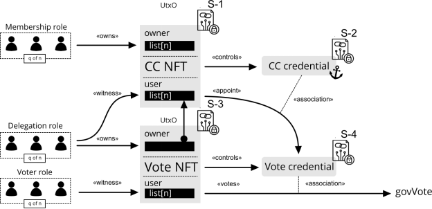

# CC scripts E2E example
In this E2E example, we will demonstrate how the CC scripts can be deployed and how to operate them. For convenience, this example uses a local testnet that, when spun up, has a hard-coded CC script credential fixed in its genesis configuration file. Due to this setup method where we hard-code the member at startup, the currency symbols used to parameterize both the cold and hot credential of the CC member are derived from the always true minting script.

This E2E example also uses a simple dummy X509 certificate tree that can be found in the `/X509-cert-example/CA` folder. As an overview, this CA has nine children of which the first three will hold the Membership role, the next three will hold the Delegation role and the last three will hold the Voter role as per the following the overview.



## Compiling the scripts
The CC scripts are comprised of 4 scripts, two locking scripts and two that only take in a redeemer. To compile these plutus scripts to disk, you can use
```bash
nix run .#plutus-gov-tool:exe:write-scripts
```
This will compile and write the `coldAlwaysTrueMint` and `hotAlwaysTrueMint` scripts to disk and apply their currency symbol to the cold credential to constrain the `CC NFT`, after which this is also written to disk. Then, this same currency symbol is used for the `Vote NFT` and applied to the hot credential and the hot locking script. Besides the scripts, this will also write some basic datums and redeemers for the purpose of the example.

Now that we have the scripts, we can determine the script hash of the Cold credential to hard-code it into the genesis configuration located in `/local-testnet/scripts/babbage/conway-babbage-test-genesis.json`. This can be done via
```bash
cardano-cli transaction policyid --script-file assets/V3/coldCredentialScript.plutus
```

## Deploy local testnet
To deploy the local testnet you need to enter the developer shell via `nix develop`. This will bring one of the latest versions of `cardano-node`and `cardano-cli` into your path. You can check this version against
```bash
cardano-node --version 
cardano-node 8.9.0 - linux-x86_64 - ghc-8.10
git rev af4384f9a98cbe6b98a799713ee1d14a1d479cc4
```
Besides the node and cli, this shell also provides a few bash scripts to your path that will be used to showcase the CC scripts. One of those scripts is the `deploy-local-testnet` command, this will run the `scripts/babbage/mkfiles.sh` and run the nodes. In a new shell, you can verify that your testnet deployed by checking that
```bash
cardano-cli conway query committee-state --testnet-magic 42
```
shows our hard-coded cold committee member. Note that, thought this now an active CC member, the `CC NFT` is not yet locked. Also, in case you need to specify the node socket path, this is located in `/local-testnet/example/node-spo1/node.sock`.

You can use `Ctrl + C` to forcefully terminate the scripts that run the nodes. If you want to respin the network again, you can use the `purge-local-testnet` command, this will delete the blockchain (after which you can deploy again).

## Bootstrap scripts
As mentioned above, in setting up this local testnet, we hard-coded the cold CC credential. But this is just a part of the solution, as per the scripts, this credential is governed by the `CC NFT`, so we have to mint this first and lock it in our cold credential locking script (script S-1 in the diagram).

To fund these transactions, we use the keys in the `/local-testnet/example/utxo-keys` folder. For convenience, we create a new directory for this in the x509 example folder and copy one of the key pairs.
```bash
mkdir x509-cert-example/orchestrator
cd x509-cert-example/orchestrator
cp ../../local-testnet/example/utxo-keys/utxo1.skey ./orchestrator.skey
cp ../../local-testnet/example/utxo-keys/utxo1.vkey ./orchestrator.vkey
cardano-cli address build --testnet-magic 42 --payment-verification-key-file orchestrator.vkey > orchestrator.addr
```
If all went well, you should be able to see the funds via
```bash
cardano-cli query utxo --testnet-magic 42 --address $(cat orchestrator.addr)
```
To mint the two NFT's (the `CC NFT` and `Vote NFT`) we first calculate the minting policy of the `alwaysTrueMint.plutus` script via
```bash
cardano-cli transaction policyid --script-file ../../assets/V3/coldAlwaysTrueMint.plutus > coldAlwaysTrueMint.pol
cardano-cli transaction policyid --script-file ../../assets/V3/hotAlwaysTrueMint.plutus > hotAlwaysTrueMint.pol
```
Then we get the address of the two lock scripts via
```bash
cardano-cli address build --testnet-magic 42 --payment-script-file ../../assets/V3/coldLockScript.plutus > coldLockScript.addr
cardano-cli address build --testnet-magic 42 --payment-script-file ../../assets/V3/hotLockScript.plutus > hotLockScript.addr
```
When the scripts were written to disk, it also wrote the initial datums for the cold and hot locking scripts, where the first three children hold the Membership role and the next three children the Delegate role, the last three children hold the Voter role. These datums are stored in the `/assets/datums` folder. We now have everything to deploy our application with the initial state. Please note that both locking scripts require the datum to be inline, having just a hash makes it unspendable. We can create such a transaction via
```bash
cardano-cli conway transaction build --testnet-magic 42 \
 --tx-in "$(cardano-cli query utxo --address "$(cat orchestrator.addr)" --testnet-magic 42 --out-file /dev/stdout | jq -r 'keys[0]')" \
 --tx-in-collateral "$(cardano-cli query utxo --address "$(cat orchestrator.addr)" --testnet-magic 42 --out-file /dev/stdout | jq -r 'keys[0]')" \
 --mint "1 $(cat coldAlwaysTrueMint.pol).4343204e4654 + 1 $(cat hotAlwaysTrueMint.pol).566f7465204e4654" \
 --tx-out $(cat coldLockScript.addr)+5000000+"1 $(cat coldAlwaysTrueMint.pol).4343204e4654" \
 --tx-out-inline-datum-file ../../assets/datums/initColdLockScriptDatum.json \
 --tx-out $(cat hotLockScript.addr)+5000000+"1 $(cat hotAlwaysTrueMint.pol).566f7465204e4654" \
 --tx-out-inline-datum-file ../../assets/datums/initHotLockScriptDatum.json \
 --change-address $(cat orchestrator.addr) \
 --mint-script-file ../../assets/V3/coldAlwaysTrueMint.plutus --mint-redeemer-value {} \
 --mint-script-file ../../assets/V3/hotAlwaysTrueMint.plutus --mint-redeemer-value {} \
 --out-file tx.raw
```
which the orchestrator can sign and submit via
```bash
cardano-cli transaction sign --testnet-magic 42 --signing-key-file orchestrator.skey --tx-body-file tx.raw --out-file tx.signed
cardano-cli transaction submit --testnet-magic 42 --tx-file tx.signed
```
If we query the blockchain again, we can view the result via
```bash
cardano-cli query utxo --testnet-magic 42 --address $(cat coldLockScript.addr)
cardano-cli query utxo --testnet-magic 42 --address $(cat hotLockScript.addr)
```
You can also add the `--output-json` flag to make the inline datum more readable.
## Delegate voting right to hot credential
Now that we have hard-coded the cold credential in the list of CC members and locked the assets, we can utilize the cold locking script to delegate their voting right to our hot credential script. This because the CC member did not authorize one yet, 
```bash
cardano-cli conway query committee-state --testnet-magic 42
{
    "committee": {
        "scriptHash-XXXXXX": {
            "expiration": 50000,
            "hotCredsAuthStatus": {
                "tag": "MemberNotAuthorized"
            },
            "nextEpochChange": {
                "tag": "NoChangeExpected"
            },
            "status": "Active"
        }
    },
    "epoch": 7,
    "quorum": 0.0
}
```
To create an authorization certificate from the cold credential script to the hot credential script, you can use
```bash
cardano-cli conway governance committee create-hot-key-authorization-certificate --cold-script-file ../../assets/V3/coldCredentialScript.plutus --hot-script-file ../../assets/V3/hotCredentialScript.plutus --out-file cc-hot-auth.cert
```
To issue certificate via the cold locking script, we can use 
```bash
cardano-cli conway transaction build --testnet-magic 42 \
 --tx-in "$(cardano-cli query utxo --address "$(cat orchestrator.addr)" --testnet-magic 42 --out-file /dev/stdout | jq -r 'keys[0]')" \
 --tx-in-collateral "$(cardano-cli query utxo --address "$(cat orchestrator.addr)" --testnet-magic 42 --out-file /dev/stdout | jq -r 'keys[0]')" \
 --tx-in "$(cardano-cli query utxo --address "$(cat coldLockScript.addr)" --testnet-magic 42 --out-file /dev/stdout | jq -r 'keys[0]')" \
 --tx-in-script-file ../../assets/V3/coldLockScript.plutus \
 --tx-in-inline-datum-present \
 --tx-in-redeemer-file ../../assets/redeemers/delegateRedeemer.json \
 --tx-out $(cat coldLockScript.addr)+5000000+"1 $(cat coldAlwaysTrueMint.pol).4343204e4654" \
 --tx-out-inline-datum-file ../../assets/datums/initColdLockScriptDatum.json \
 --required-signer-hash $(cat ../CA/children/child-4/child-4.keyhash) \
 --required-signer-hash $(cat ../CA/children/child-5/child-5.keyhash) \
 --required-signer-hash $(cat ../CA/children/child-6/child-6.keyhash) \
 --certificate-file cc-hot-auth.cert \
 --certificate-script-file ../../assets/V3/coldCredentialScript.plutus \
 --certificate-redeemer-value {} \
 --change-address $(cat orchestrator.addr) \
 --out-file tx.raw
```
Which can be signed and sent via
```bash
cardano-cli transaction sign --testnet-magic 42 \
 --signing-key-file orchestrator.skey \
 --signing-key-file ../CA/children/child-4/child-4.skey \
 --signing-key-file ../CA/children/child-5/child-5.skey \
 --signing-key-file ../CA/children/child-6/child-6.skey \
 --tx-body-file tx.raw \
 --out-file tx.signed
cardano-cli transaction submit --testnet-magic 42 --tx-file tx.signed
```
Note that we signed this transaction with 3 out of 3 keys in the Membership role, this could also be done via just two. Alternatively, this transaction can be partly signed separately by each party via the command `cardano-cli transaction witness` command
```bash
cardano-cli transaction witness \
  --tx-body-file tx.raw \
  --signing-key-file ../CA/children/child-X/child-X.skey \
  --testnet-magic 42 \
  --out-file txPartialChildX.witness
```
and aggregated via
```bash
cardano-cli transaction assemble \
  --tx-body-file tx.raw \
  --witness-file txPartialOrchestrator.witness \
  --witness-file txPartialChild4.witness \
  --witness-file txPartialChild5.witness \
  --witness-file txPartialChild6.witness \
  --out-file tx.signed
```
If we now query the committee state again, we see that the hot credential is given by the `hotCredentialScript.plutus` script hash
```bash
cardano-cli conway query committee-state --testnet-magic 42
cardano-cli transaction policyid --script-file ../../assets/V3/hotCredentialScript.plutus
{
    "committee": {
        "scriptHash-XXXXXXXX": {
            "expiration": 50000,
            "hotCredsAuthStatus": {
                "contents": {
                    "scriptHash": "YYYYYYYY"
                },
                "tag": "MemberAuthorized"
            },
            "nextEpochChange": {
                "tag": "NoChangeExpected"
            },
            "status": "Active"
        }
    },
    "epoch": 9,
    "quorum": 0.0
}
```
The scripts are now both deployed and configured as intended.

## Resign membership role

